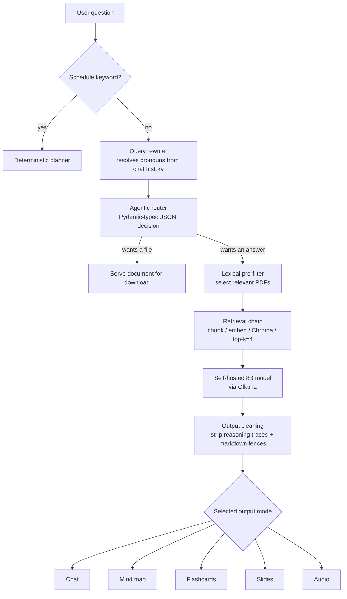

# R2D2 — Privacy-Preserving RAG Study Assistant

A local-first study assistant that answers questions about your own course material and turns it into revision content — mind maps, flashcards, slide decks and audio summaries.

Everything runs on the user's machine. No document, question or answer ever leaves the computer: the language model is self-hosted, the vector index is local, and there is no external API call in the pipeline.

Built as a student project at **ISAE-SUPAERO** (January – March 2026) by a 5-person team.


---

## Why local-first?

Two constraints drove every design decision in this project:

| Constraint | Consequence |
| --- | --- |
| Course material must not be uploaded to a third party | Self-hosted model, local vector store, no external API |
| Must run on a student laptop, without a dedicated GPU | 8B-parameter model, lightweight CPU embeddings, aggressive pre-filtering |

The interesting engineering problem here was not *which model to use*, but **how to get reliable, well-formatted behaviour out of a small constrained model running on modest hardware**.

---

## How it works



### Request lifecycle

1. **Keyword interception** — schedule-related requests bypass the LLM pipeline entirely and are handled by a deterministic planner (see *Design decisions*).
2. **Contextual query rewriting** — the last 3 exchanges are passed to the model, which rewrites the question into a standalone form. `"and its applications?"` retrieves nothing from vector index; `"what are the applications of the Gertsenshtein effect?"` does.
3. **Agentic routing** — a second, temperature-0 model call decides whether the user wants *a document* or *an answer*. The decision is returned as strict JSON validated against a Pydantic schema (`veut_telecharger`, `nom_fichier_cible`, `raisonnement`). `"give me the mechanics course"` and `"explain mechanics to me"` are different intents and are handled differently.
4. **Lexical pre-filter** — candidate PDFs are narrowed by keyword match on filenames (after French stop-word removal) before any embedding happens. Embedding 30 PDFs on CPU when the question concerns one is the difference between 2 seconds and 40.
5. **Retrieval** — PyPDF extraction → recursive splitting (600 chars, 100 overlap) → MiniLM embeddings → Chroma → top-k retrieval (k=4).
6. **Generation** — the retrieved context, a profile-derived system prompt and the format instruction for the selected mode are assembled and sent to the model.
7. **Output cleaning** — reasoning traces (`<think>…</think>`), tool-call artefacts and markdown fences are stripped, then the format-specific parser/repair layer runs.

---

## Output modes

A single retrieval chain feeds five constrained output formats. Format compliance is enforced at the prompt level **and** validated downstream — a small model does not reliably respect a machine-readable format on its own.

| Mode | Output | Downstream handling |
| --- | --- | --- |
| Chat | Markdown answer | Direct render |
| Mind map | Rendered diagram | Mermaid extraction, line-level syntax filtering, header repair |
| Flashcards | Q/A grid | JSON parsing, 2-column collapsible render |
| Slides | Downloadable `.pptx` | JSON parsing → `python-pptx` generation |
| Audio | Playable audio | Markdown symbol stripping (so TTS doesn't read "asterisk"), then `gTTS` |

Answers are personalised from the user's stored profile: expertise level, role, learning objective and preferred tone are injected into the system prompt.

---

## Stack

| Component | Role |
| --- | --- |
| **Ollama** | Runs the language model locally |
| **deepseek-r1:8b** | The reasoning model (~6 GB RAM, CPU-viable) |
| **LangChain** | Pipeline orchestration (loaders, splitters, retrieval chains) |
| **ChromaDB** | Vector store — retrieval by semantic proximity |
| **all-MiniLM-L6-v2** | Sentence embeddings (~80 MB, fast on CPU) |
| **PyPDF** | Text extraction from course PDFs |
| **Pydantic** | Schema validation of the router's JSON output |
| **Streamlit** | Web interface, written entirely in Python |
| **gTTS / python-pptx / fpdf** | Audio, PowerPoint and PDF generation |
| **Mermaid** | Text-described diagrams, rendered client-side |

---

## Getting started

### Prerequisites

- Python 3.10+
- [Ollama](https://ollama.com) installed and running

```bash
ollama pull deepseek-r1:8b
```

### Install

```bash
git clone https://github.com/<your-username>/COS_NIA_02.git
cd COS_NIA_02
python -m venv .venv && source .venv/bin/activate   # Windows: .venv\Scripts\activate
pip install -r requirements.txt
```

### Run

```bash
streamlit run main.py
```

Then open `http://localhost:8501`, create an account from the sidebar, upload a PDF, and ask a question.

Convenience launchers are provided: `start.sh` (Linux/WSL) and `app.bat` (Windows). Note that they make platform-specific assumptions — see *Known limitations*.

---

## Project structure

```
main.py                  Streamlit UI and chat orchestration          (370 LOC)
utils.py                 Path constants and folder initialisation
modules/
  rag.py                 Retrieval chain, system prompts, query rewriting  (126)
  files.py               Agentic file router and document pre-filtering     (62)
  generators.py          Mermaid / audio / PPTX generation                  (97)
  auth.py                Accounts and JSON-persisted user profiles          (68)
  schedule.py            Revision planner and PDF export                   (254)
data/
  cours/                 Course PDFs (user-supplied)
  users/                 One JSON profile per user
generated/               Generated artefacts (audio, decks)
```

---

## Design decisions

Worth stating explicitly, since several of these look like shortcuts and are not:

**The revision planner does not use the LLM.** Free-slot computation and subject assignment are pure Python: chronological scan of the user's fixed commitments, then round-robin assignment across available courses, with the session type derived from slot duration. This is instant, deterministic and testable — a language model would have been slow and non-reproducible for what is an interval-allocation problem. Knowing when *not* to use a model is a design decision, not an omission.

**Prompt-level format enforcement rather than native tool-calling.** At the time of writing, native structured output through Ollama with this model was unreliable. The chosen approach — strict format instructions plus a defensive parsing layer — was a deliberate trade-off, not a lack of awareness. See the roadmap.

**Temperature 0 for the router, 0.1 for query rewriting, 0 for retrieval.** On structured tasks, creativity is a defect.

**Chunk size 600 / overlap 100.** Short chunks retrieve precisely but lose context; long chunks saturate an 8B model's context window and dilute the signal. 600 characters is roughly one paragraph of course material; the overlap prevents a definition from being split across a boundary. These values were set by intuition and never measured — which is the first thing the roadmap addresses.

---

## Known limitations

Stated honestly, because they are the interesting part:

- **The vector index is rebuilt on every query.** PDFs are reloaded, re-split and re-embedded on each request, and nothing is persisted to disk. This is the main architectural weakness and dominates latency.
- **No evaluation harness.** Retrieval quality and format compliance were judged by eye. There is no measured grounding rate and no regression signal.
- **No test suite.**
- **Passwords are hashed with unsalted SHA-256.** Adequate for a classroom project with four accounts; not adequate for anything else.
- **Platform assumptions are inconsistent as group were working on different OS.** The launcher script targets WSL/Windows (`explorer.exe`) while the in-app shutdown button executes AppleScript (macOS).
- **Dependency mismatch.** `modules/rag.py` imports `langchain_classic`, which is not declared in `requirements.txt`.
- **The calendar view is pinned to a hard-coded week** (`2024-01-01` onwards); it displays a generic Monday–Friday grid rather than real dates.
- Code comments and some UI strings are in French.

## Roadmap

1. Persist the Chroma index to disk; index at ingestion time rather than at query time, with hash-based invalidation.
2. Build an evaluation set (20–30 questions over a known corpus) and measure grounding rate and format-compliance rate.
3. Replace filename-based pre-filtering with metadata filtering at query time.
4. Migrate to native structured output / tool-calling now that support has matured.
5. Abstract the inference backend behind an interface, so a local model and a remote endpoint become interchangeable per deployment context.
6. Add a test suite, fix the dependency declaration, and move password hashing to Argon2.

---

## Credits

Student project developed by a 5-person team at ISAE-SUPAERO,
January – March 2026.

- Nayel Hamada — [@nayelhamada](https://github.com/nayelhamada)
- Thomas Dos — [@Rasalghulsslayer](https://github.com/Rasalghulsslayer)
- Alexandre Gouzi — [/]
- Gregoire Vassal — [/]
- Kilian Labastie - [/]

This repository is a fork of the original team project. Upstream history and
authorship are preserved.
